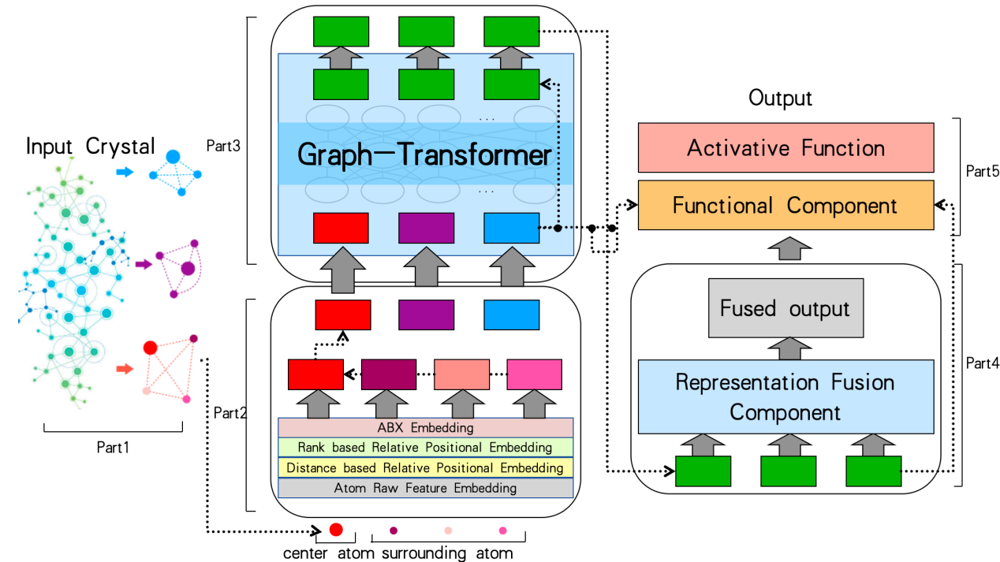

# CrystalGraphBert

## Method



## Install and Data

### 1. Install and Dependancy

Just download the imported package in the `.py` and `.ipynb`.

### 2. Data Processing

Download the traning dataset locally, and run the script in `dataProcess.ipynb`. (Remember to modify your path of data, which in noticed by TODO in  `dataProcess.ipynb`)

### 3. Train

```python
cd model
python train.py
```

Remember to modify your path of data, which in noticed by TODO in `train.ipynb`.

## Result

| Model \ Dataset  | Water Splitting |
| ---------------- | --------------- |
| CGCNN            | 1.623           |
| CrystalGraphBert | 3.80            |

PS：

The original testing data of Water Splitting for CGCNN can't be found because of the change of the dataset. The data is from https://cmr.fysik.dtu.dk/cubic_perovskites/cubic_perovskites.html .

## Reference

Paper: Zhang J, Zhang H, Xia C, et al. Graph-bert: Only attention is needed for learning graph representations[J]. arXiv preprint arXiv:2001.05140, 2020.

Code: https://github.com/jwzhanggy/Graph-Bert

Data: [Dataset Water Splitting](https://cmr.fysik.dtu.dk/cubic_perovskites/cubic_perovskites.html#abo3-candidates-for-water-splitting)

## Information

XiYuan Project in Fudan University.

Advisor: Prof. Yiqiang Zhan, Prof. Xia Cai

Student: Zhijian Zhou, Yang Shen
